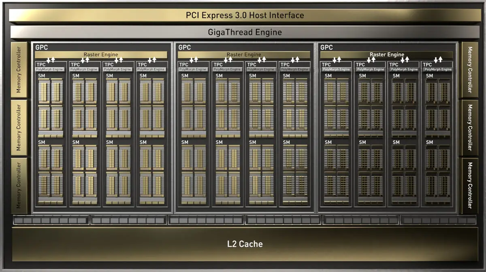
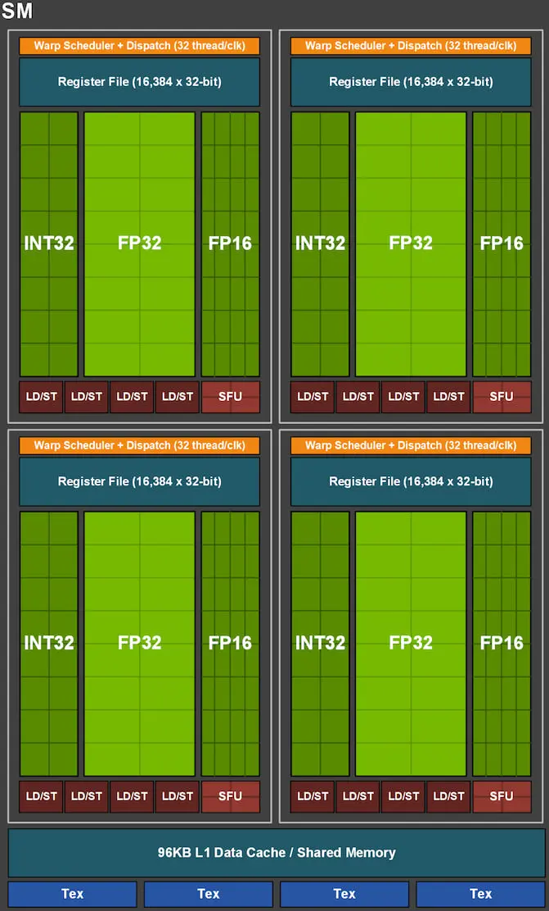
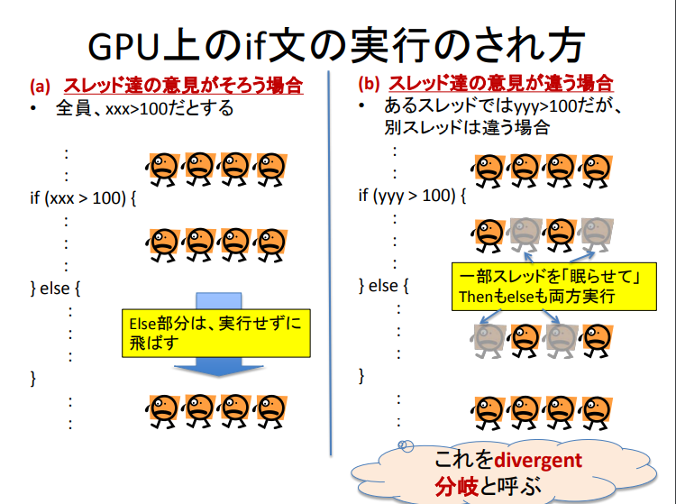
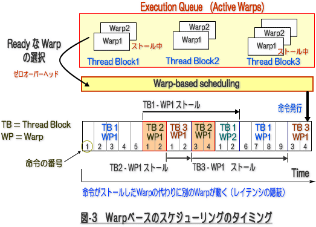

# cuda_env container with user/group settings
docker-compose tool for cuda development environment with user/group settings.

cuda_env/code is a shared directory between your local machine and container.

The 'cuda_env/code' directory is mounted to '~/work' in a container, so written code should be stored in 'cuda_env/code'.

## setup
All you need to do is to set each parameter in the .env file.

## creating image and container if those dosent exist (starting container if those already exist)

### ubuntu
```sh
docker-compose up -d
```

### WSL2 (if you want to use WSLg)
```sh
docker-compose -f docker-compose.yml -f docker_compose_additional/docker-compose.wslg.yml up -d
```
If you run `docker-compose up -d` command after entering the command above, any containers that were previously created by the command above will be overwritten by new one, so please be careful (vice versa).

## entering into existing container
```sh
docker-compose exec -it cuda_env bash
```

## starting existing stopped container
```sh
docker-compose start
```

## stopping existing running container
```sh
docker-compose stop
```

# study about CUDA and GPU
https://docs.nvidia.com/cuda/cuda-c-programming-guide/
## 使用しているGPU
Geforce GTX 1660 super
<figure align="center">
  
  <figcaption>Geforce GTX 1660系のGPUの概念図</figcaption>
</figure>

```sh
Device 0: "NVIDIA GeForce GTX 1660 SUPER"
  CUDA Driver Version / Runtime Version          12.1 / 12.1
  CUDA Capability Major/Minor version number:    7.5
  Total amount of global memory:                 6144 MBytes (6441992192 bytes)
  (022) Multiprocessors, (064) CUDA Cores/MP:    1408 CUDA Cores
  GPU Max Clock rate:                            1815 MHz (1.81 GHz)
  Memory Clock rate:                             7001 Mhz
  Memory Bus Width:                              192-bit
  L2 Cache Size:                                 1572864 bytes
  Maximum Texture Dimension Size (x,y,z)         1D=(131072), 2D=(131072, 65536), 3D=(16384, 16384, 16384)
  Maximum Layered 1D Texture Size, (num) layers  1D=(32768), 2048 layers
  Maximum Layered 2D Texture Size, (num) layers  2D=(32768, 32768), 2048 layers
  Total amount of constant memory:               65536 bytes
  Total amount of shared memory per block:       49152 bytes
  Total shared memory per multiprocessor:        65536 bytes
  Total number of registers available per block: 65536
  Warp size:                                     32
  Maximum number of threads per multiprocessor:  1024
  Maximum number of threads per block:           1024
  Max dimension size of a thread block (x,y,z): (1024, 1024, 64)
  Max dimension size of a grid size    (x,y,z): (2147483647, 65535, 65535)
  Maximum memory pitch:                          2147483647 bytes
  Texture alignment:                             512 bytes
  Concurrent copy and kernel execution:          Yes with 2 copy engine(s)
  Run time limit on kernels:                     Yes
  Integrated GPU sharing Host Memory:            No
  Support host page-locked memory mapping:       Yes
  Alignment requirement for Surfaces:            Yes
  Device has ECC support:                        Disabled
  Device supports Unified Addressing (UVA):      Yes
  Device supports Managed Memory:                Yes
  Device supports Compute Preemption:            Yes
  Supports Cooperative Kernel Launch:            Yes
  Supports MultiDevice Co-op Kernel Launch:      No
  Device PCI Domain ID / Bus ID / location ID:   0 / 9 / 0
  Compute Mode:
     < Default (multiple host threads can use ::cudaSetDevice() with device simultaneously) >
```
CUDA core64個を集積してクラスタ化したStreaming Multiprocessor(SM)を22個搭載している.\
1660 superの上位機種である1660tiは24個, その下位機種のsuperはSMが2個なくなっている。

Streaming Multiprocessorの中身は以下のようになっており、INT32とFP32の演算器が64個存在する。\
おそらくINT32とFP32の演算器の1セットが1個のCUDA coreということになっている。\
FP16演算器がその倍の128個存在する。よって,GTX1660superの半精度浮動小数点の演算性能は単精度の2倍となる。\
SFU(Special Function Unit)は、三角関数や指数関数などの数学関数を高速に計算するために最適化されている回路。\
疑問:4個あるっぽいけど、たくさんなくて良いの？\
LD/STはSM内でのロード(LD)とストア(ST)の命令を処理するための回路.4つ存在する.\
SM内に存在するスレッドブロックからのロード/ストア命令を処理するために用いられる. 4つ存在する.\
図にはないが, FP64演算器が2つしかないので,倍精度は単精度計算の1/32倍の性能しかでない.


<figure align="center">
  
  <figcaption>Geforce GTX 1660系のStreaming Multiprocessorの内部の概念図</figcaption>
</figure>

## コード書く時の考え方
1コア(1演算器?)で1スレッド担当.
プログラムの流れは
1. ホスト(CPU)メモリからデバイス(GPU)メモリへPCIeを通してデータ転送 
2. GPUで計算
3. 計算結果をGPUからCPUへ転送

CPUとGPUは非同期で動く.同期させたかったらcudaDeviceSynchronize\
デバイスメモリの確保/開放はcudaMalloc/cudaFree\
メモリのデータ転送はcudaMemcpy\
デバイスメモリへの値セットはcudaMemset

CUDAプログラム中の概念では1つの処理を行うスレッド,スレッドの塊のブロック,ブロックの塊のグリッドがある.\
グリッド内のブロック数やブロック内のスレッド数はプログラム側で制約の範囲内で自由に決めれる.\
1つのSMで1つのブロックを担当するとのことだが,例えば半精度浮動小数点計算をさせるスレッドが32個入ったブロックが2個あったら,32個のCuda coreを持つSMだったら同時に2ブロック処理することもできる(1回のinstructionでwarp単位のスレッド数を処理可能、よって1warp分のスレッドを持つブロックが二つあれば2instructionを並行して実行可能.仮にブロック内スレッド数が30とかだったら,1instructionで32コアを必ず使うので2コア分が余ってしまうのでブロック内スレッド数はwarpの倍数であることが好ましい.).ブロック内部のスレッドが複数のSMにまたがることはない.各々のブロックは、他のブロックとは独立に処理を実行する.

ブロックがギガスレッドエンジンによって各SMのワープスケジューラに分配され、ワープスケジューラがブロック内のスレッドをワープ単位(32スレッド)に分割する。ワープ内のスレッドはすべて同じ命令を実行する。
よって、ブロック内のスレッド数は32の倍数にしたほうが良い。

以下のようにワープ内のスレッドで条件分岐がある場合、ワープ内全スレッドが同一パスに分岐する場合は全スレッドが分岐先のみを実行する。
一方、ワープ内で異なるパスに分岐する場合は、全スレッドが両方の命令を実行(diverged branch)する。その際に、本来そのパスに入らないはずのスレッドはinactive状態となる。性能低下の原因の一つ。

<figure align="center">
  
  <figcaption>diverged branchの説明</figcaption>
</figure>

以下の図はレイテンシ隠しについての概念図. ワープ実行中は、レイテンシ(あるワープが次のinstructionを実行できるようになるまでにかかる時間)によって実行がストールする場合がある.SM内で実行していたワープAが何らかの理由でストールする場合(例えば必要なメモリを読み込んでいたり),ワープスケジューラによって別のinstructionが実行可能状態にあるワープBにゼロオーバヘッドで入れ替えることができる.そうすることでレイテンシが実質見えなくなる.
nvidiaのサイトによれば,4つあるすべてのワープスケジューラが,何かのレイテンシの間に常にinstruction実行可能状態にあるワープを持っていっるようにすると効率が良いらしい。
例えば、あるワープが特殊関数計算のために4clock分ストールする必要があるとする.その場合,gtx1660 superは4つのワープスケジューラがあるので,16warp分あれば必ずGPUを常に忙しくできるとのこと。なんで16warp分必要であると断言できるのかはわからない(kernelの実装等で必要warp数は色々変動するはず)が、少なくともレイテンシを隠すためにはなるべくたくさんのwarpが必要なのは間違いない。
また、あるブロックAに所属するwarpのレイテンシ隠しに必要なwarpの所属ブロックは必ずしもAである必要はない。ブロック数多くてもレイテンシ隠しは可能。

<figure align="center">
  
  <figcaption>あるSM内でのレイテンシ隠しの概念図</figcaption>
</figure>

また、同一ブロック内でのメモリー同期や同一ブロック内での処理の同期(__synchronize)を行う場合,必ずあるブロック内のすべてのwarpがストール状態になる(瞬間がある).その場合はブロック内のwarpがいくら多くてもレイテンシは隠せず、代わりに多数のブロックを1つのSM内に
配置できればあるブロックのワープがほとんどストール中に別のブロックの処理を行うことでレイテンシ隠しができる。
つまり、ブロック内ワープの同期処理を行う場合はブロック数を多くすることも重要。

同じSM内に同時にキューできる理論上(シェアードメモリ無限、レジスタ無限を仮定した場合)の最大のブロック数,warp数,スレッド数はそれぞれ16,32,1024である。
実際にはSM内にキューされる最大ブロック数,warp数,スレッド数は, min(1ブロック内で使用するシェアードメモリの容量×NがTotal shared memory per multiprocessorを超えない最大のN, 1ブロック内で使用するレジスタ数×NがSM内のレジスタ数を超えない最大のN,ブロック数の最大値の理論値)となる。(ちなみにminの中身は適当かも。言いたいことは、ブロックが使用するリソース量によっても、キューされるブロック数は左右される。)

デバイス(GPU)で計算させるブロック数の数は、デバイスのSMの数の倍数であることが望ましい(恐らく、ブロックはSMに均等に割り振られるようになっているはず。なのでデバイスに計算させる合計ブロック数が22なら,22個のsmそれぞれが1個のブロックを担当する。そのような記述は探しても見つからないが、これが一番効率が良いのであっているはず)。

__shared__演算子により,あるブロック内部で共用できるメモリをシェアードメモリに用意できる.\
ex.
```c++
__shared__ float array[64];
```
sharedメモリは,1単位を4byte(ちょうどfloat)として0~31個のbankに割り振られている.
上の例の場合,array[0]とarray[0+32]がbank0に,array[1]とarray[1+32]がbank1に,array[N]とarray[N+32]がbankNに割り振られる。
重要なのは,あるwarpが共有メモリから値を読み書きする際に、1bankへの2個同時I/Oはできない。つまり、あるwarp内が共有メモリでのI/Oを
行う場合は各スレッドが別bankへのI/Oをするように心掛ける必要がある.(ただし1bankへの複数個同時の、同じアドレスへのI/Oはbroadcastされるので同時I/Oが可能。ex. warp内全スレッドがarray[0]にアクセスする場合は1回のI/Oで可能)
Coalesce Accessを意識する。

似たような概念はSM-グローバルメモリ間にも存在する.らしい
Global memory resides in device memory and device memory is accessed via 32-, 64-, or 128-byte memory transactions. These memory transactions must be naturally aligned: Only the 32-, 64-, or 128-byte segments of device memory that are aligned to their size (i.e., whose first address is a multiple of their size) can be read or written by memory transactions.

When a warp executes an instruction that accesses global memory, it coalesces the memory accesses of the threads within the warp into one or more of these memory transactions depending on the size of the word accessed by each thread and the distribution of the memory addresses across the threads. In general, the more transactions are necessary, the more unused words are transferred in addition to the words accessed by the threads, reducing the instruction throughput accordingly. For example, if a 32-byte memory transaction is generated for each thread’s 4-byte access, throughput is divided by 8.

https://leimao.github.io/blog/CUDA-Data-Alignment/
微妙によくわからない。
重要なのは
Always making the word size equal to 1, 2, 4, 8, or 16 bytes and the data naturally aligned.
```c++
struct __align__(4) int8_3_4_t
{
    int8_t x;
    int8_t y;
    int8_t z;
};

struct __align__(16) float3_16_t
{
    float x;
    float y;
    float z;
};
```
こんな感じで,例えば配列に入れる1要素のデータが1, 2, 4, 8, or 16 bytesであれば良いメモリアクセス性能が出るとのこと


レジスタは、1要素当たり32bitで1ブロック当たり65536個のレジスタを使える.long, double, ポインタなどの64bit型には2つ使われる.
自動変数は可能ならレジスタに割り当てられる.自動変数がレジスタに収まらない場合やインデックスアクセスが必要な場合は,ローカルメモリ(低速)に割り当てられる.

Two-Dimensional Arrays

A common global memory access pattern is when each thread of index (tx,ty) uses the following address to access one element of a 2D array of width width, located at address BaseAddress of type type* (where type meets the requirement described in Maximize Utilization):

BaseAddress + width * ty + tx
For these accesses to be fully coalesced, both the width ‘of the thread block and the width of the array must be a multiple of the warp size.

In particular, this means that an array whose width is not a multiple of this size will be accessed much more efficiently if it is actually allocated with a width rounded up to the closest multiple of this size and its rows padded accordingly. The cudaMallocPitch() and cuMemAllocPitch() functions and associated memory copy functions described in the reference manual enable programmers to write non-hardware-dependent code to allocate arrays that conform to these constraints.
2次元配列,3次元配列は専用のメモリアロケート関数を使うことで自動的にCoalesce accsess


Coalesce Accessを意識する。
同一ワープに属するスレッド群のメモリアクセスはまとめて処理される。メモリアクセスの範囲が狭ければ(ex. thread i がarray[i]にアクセスる)1トランザクションでスレッド内で必要なメモリアクセスが完結する.多分キャッシュとかそれの恩恵?

Calculates block size that achieves maximum SM-level occupancy(i.e. the maximum number of active warps with the smallest number of blocks -> たぶん別ブロック間warp切り替えって同一ブロック内warp切り替えよりコストが高いからblockの数が少なくなるようにしているのだと思われる。多分だけど__synchthreadsがある場合はこの理論値と実際の最適な値はずれてくるはず(ブロック内全スレッド同期処理を行うと、動けないブロックが生成される))\
Kernel block occupancy is closely correlated to performance:
```c++
cudaOccupancyMaxPotentialBlockSize(&minGridSize, &blockSize, MyKernel, 0, N);
/*
minGridSize
- Returned minimum grid size needed to achieve the best potential occupancy
blockSize
- Returned block size
func
- Device function symbol
dynamicSMemSize
- Per-block dynamic shared memory usage intended, in bytes
blockSizeLimit
- The maximum block size func is designed to work with. 0 means no limit.
*/
// Round up according to array size
gridSize = (N + blockSize - 1) / blockSize; 
MyKernel<<< gridSize, blockSize >>>(array, N);
```

Invoking this method returns the minGridSize and blockSize optimal to execute a kernel with the given shared memory usage (dynamicSMemSize) and total number of kernels you intend to do work on (blockSizeLimit, e.g. array length). We can further abstract this by writing a simple helper which will determine the launch configuration we should use:
```c++
template <class T>
__host__ void getLaunchConfiguration(T t, int n, int *blocks, int *threads) {
  cudaOccupancyMaxPotentialBlockSize(blocks, threads, t, 0, n);
  *blocks = (n + *threads - 1) / *threads;
}
```


以下のコード
```c++
// Device code
__global__ void MyKernel(int *array, int arrayCount)
{
    int idx = threadIdx.x + blockIdx.x * blockDim.x;
    __syncthreads();
    if (idx < arrayCount) {
        array[idx] *= array[idx];
    }
}

// Host code
int launchMyKernel(int arrayCount)
{
    int blockSize;      // The launch configurator returned block size
    int minGridSize;    // The minimum grid size needed to achieve the
                        // maximum occupancy for a full device
                        // launch
    int gridSize;       // The actual grid size needed, based on input
                        // size

    cudaOccupancyMaxPotentialBlockSize(
        &minGridSize,
        &blockSize,
        (void*)MyKernel,
        0,
        arrayCount);

	std::cout << blockSize << "," << minGridSize << "," << blockSize*minGridSize << std::endl;

    // If interested, the occupancy can be calculated with
    // cudaOccupancyMaxActiveBlocksPerMultiprocessor

    return 0;
}

int main()
{

	launchMyKernel(1024*44);
    launchMyKernel(64);
}
```
outputは
```sh
1024,22,22528
64,352,22528
```
となる。これは恐らく,the maximum number of active warps with the smallest number of blocksの原則のもと,まずarray lengthから32の倍数での、array length以上の最小blocksize数が求められる(ただし1024は超えない。また Total amount of shared memory per blockは超えてはならない. ハードウェアからの制約)。
その後で、array lengthの数は関係なしに,求められたblocksize数を持つblockで全てのSMに限界まで入れられるblockの数を計算している(ハードウェアからの制約も取り入れる).
実際の計算では、
```c++
gridSize = (arrayCount + blockSize - 1) / blockSize;
```
としてgridSizeを求めればよい.
grid内のブロックが無限にあり常に計算させたいという状況であれば,minGridSizeの倍数でblockを投入していけばよい.

以下の関数を使って
```c++
template<typename UnaryFunction , class T > CUDART_DEVICE cudaError_t
       cudaOccupancyMaxPotentialBlockSizeVariableSMem (int * minGridSize, int * blockSize, T
       func, UnaryFunction blockSizeToDynamicSMemSize, int blockSizeLimit = 0)
    /*
       Parameters:
           minGridSize - Returned minimum grid size needed to achieve the best potential
           occupancy
           blockSize - Returned block size
           func - Device function symbol
           blockSizeToDynamicSMemSize - A unary function / functor that takes block size, and
           returns the size, in bytes, of dynamic shared memory needed for a block
           blockSizeLimit - The maximum block size func is designed to work with. 0 means no
           limit.
    */
```

以下のコードを使っても同じことが可能。Mykernel_byte関数の引数はblock_size, 返り値がblock内部で用いるsharedメモリの容量(byte)となる。
```c++
__global__ void MyKernel(int *array, int arrayCount)
{
    int idx = threadIdx.x + blockIdx.x * blockDim.x;
    __syncthreads();
    if (idx < arrayCount) {
        array[idx] *= array[idx];
    }
}

int MyKernel_byte(int block_size)
{
    return 0;
}

// Host code
int launchMyKernel(int arrayCount)
{
    int blockSize;      // The launch configurator returned block size
    int minGridSize;    // The minimum grid size needed to achieve the
                        // maximum occupancy for a full device
                        // launch
    int gridSize;       // The actual grid size needed, based on input
                        // size

    cudaOccupancyMaxPotentialBlockSizeVariableSMem(
        &minGridSize,
        &blockSize,
        (void*)MyKernel,
        MyKernel_byte,
        arrayCount);

	std::cout << blockSize << "," << minGridSize << "," << blockSize*minGridSize << std::endl;

    // If interested, the occupancy can be calculated with
    // cudaOccupancyMaxActiveBlocksPerMultiprocessor

    return 0;
}

int main()
{

	launchMyKernel(64);
}
```

Applications should strive to minimize data transfer between the host and the device. One way to accomplish this is to move more code from the host to the device, even if that means running kernels that do not expose enough parallelism to execute on the device with full efficiency.

Also, because of the overhead associated with each transfer, batching many small transfers into a single large transfer always performs better than making each transfer separately.

1instruction = 32 operations

In general, code compiled with -ftz=true (denormalized numbers are flushed to zero) tends to have higher performance than code compiled with -ftz=false. Similarly, code compiled with -prec-div=false (less precise division) tends to have higher performance code than code compiled with -prec-div=true, and code compiled with -prec-sqrt=false (less precise square root) tends to have higher performance than code compiled with -prec-sqrt=true. The nvcc user manual describes these compilation flags in more details.

denormalized numbers are flushed to zero ->　どういう意味？

スレッド内部でfor文を書く際に,例えば
```sh
for(int i = 0;i<100;++i)
    a[i] = 5*b[i]
```
とするよりも

```sh
for(int i = 0;i<100;i+=5)
    a[i] = 5*b[i]
    a[i+1] = 5*b[i+1]
    a[i+2] = 5*b[i+2]
    a[i+3] = 5*b[i+3]
    a[i+4] = 5*b[i+4]
```
とするほうが早い場合がある。これはプログラムの容量を犠牲にして,for分の命令を0.2倍にして命令量を減らすことで
高速化することを狙っている。cudaの場合は
By default, the compiler unrolls small loops with a known trip count. The #pragma unroll directive however can be used to control unrolling of any given loop. It must be placed immediately before the loop and only applies to that loop. It is optionally followed by an integral constant expression (ICE)13. If the ICE is absent, the loop will be completely unrolled if its trip count is constant. If the ICE evaluates to 1, the compiler will not unroll the loop. The pragma will be ignored if the ICE evaluates to a non-positive integer or to an integer greater than the maximum value representable by the int data type.
```c++
struct S1_t { static const int value = 4; };
template <int X, typename T2>
__device__ void foo(int *p1, int *p2) {

// no argument specified, loop will be completely unrolled
#pragma unroll
for (int i = 0; i < 12; ++i)
  p1[i] += p2[i]*2;

// unroll value = 8
#pragma unroll (X+1)
for (int i = 0; i < 12; ++i)
  p1[i] += p2[i]*4;

// unroll value = 1, loop unrolling disabled
#pragma unroll 1
for (int i = 0; i < 12; ++i)
  p1[i] += p2[i]*8;

// unroll value = 4
#pragma unroll (T2::value)
for (int i = 0; i < 12; ++i)
  p1[i] += p2[i]*16;
}

__global__ void bar(int *p1, int *p2) {
foo<7, S1_t>(p1, p2);
}
```

__syncthreads()のoperation数は16 (ope/clock)
よって、2clockで1instracution

The __device__ execution space specifier declares a function that is:

Executed on the device,

Callable from the device only.


The __host__ execution space specifier declares a function that is:

Executed on the host,

Callable from the host only.


The __device__ memory space specifier declares a variable that resides on the device.

At most one of the other memory space specifiers defined in the next three sections may be used together with __device__ to further denote which memory space the variable belongs to. If none of them is present, the variable:

Resides in global memory space,

Has the lifetime of the CUDA context in which it is created,

Has a distinct object per device,

Is accessible from all the threads within the grid and from the host through the runtime library (cudaGetSymbolAddress() / cudaGetSymbolSize() / cudaMemcpyToSymbol() / cudaMemcpyFromSymbol()).


The __constant__ memory space specifier, optionally used together with __device__, declares a variable that:

Resides in constant memory space,

Has the lifetime of the CUDA context in which it is created,

Has a distinct object per device,

Is accessible from all the threads within the grid and from the host through the runtime library (cudaGetSymbolAddress() / cudaGetSymbolSize() / cudaMemcpyToSymbol() / cudaMemcpyFromSymbol()).

__device__と__constatnt__メモリの違いは、__constant__はデバイス側で読み込みのみ可能だが早い。値の書き込みはホスト側から行う.動的確保が可能
\

The __shared__ memory space specifier, optionally used together with __device__, declares a variable that:

Resides in the shared memory space of a thread block,

Has the lifetime of the block,

Has a distinct object per block,

Is only accessible from all the threads within the block,

Does not have a constant address.

__shared__配列は静的の場合
```c++
#define array_size 20
__shared__ float shared[array_size];
```

動的の場合
```c++
extern __shared__ float shared[];
```
とし、もし
```c++
short array0[128];
float array1[64];
int   array2[256];
```
みたいな配列を動的に確保したかったら

```c++
extern __shared__ float array[];
__device__ void func()      // __device__ or __global__ function
{
    short* array0 = (short*)array;
    float* array1 = (float*)&array0[128];
    int*   array2 =   (int*)&array1[64];
}
```
とする。しっかりとalign(各配列ポインタの開始アドレスが,配列の各要素のデータ型の倍数であるようにする.あと要素数が32要素の倍数であると好ましい)も意識する。以下の例はalignされない例
```c++
extern __shared__ float array[];
__device__ void func()      // __device__ or __global__ function
{
    short* array0 = (short*)array;
    float* array1 = (float*)&array0[127];
}
```


The __managed__ memory space specifier, optionally used together with __device__, declares a variable that:

Can be referenced from both device and host code, for example, its address can be taken or it can be read or written directly from a device or host function.

Has the lifetime of an application.

__device__と__managed__は似ているが、__device__はホストとデバイス側で転送が必要。__magaged__はホストとデバイス側での明示的な転送は必要ない。ホストからもデバイス側からも値の読み書きが可能だが、__device__よりもoverheadがある場合がある。

色々なコードサンプルがある
https://docs.nvidia.com/cuda/cuda-c-programming-guide/index.html#code-samples


__threadfence_block() stalls current thread until all writes to shared memory are visible to other threads from the same block. It prevents the compiler from optimising by caching shared memory writes in registers. It does not synchronise the threads and it is not necessary for all threads to actually reach this instruction.
__threadfence() stalls current thread until all writes to shared and global memory are visible to all other threads.
__syncthreads() must be reached by all threads from the block (e.g. no divergent if statements) and ensures that the code preceding the instruction is executed before the instructions following it, for all threads in the block.
勝手にレジスタにキャッシュしたりされると、実際に書き込まれているメモリの値と読み込んだ値に相違が出る場合があるので__threadfenceを使う。
```c++
__device__ unsigned int count = 0;
__shared__ bool isLastBlockDone;

__global__ void sum(const float* array, unsigned int N,float* result)
{
    // Each block sums a subset of the input array
    float partialSum = calculatePartialSum(array, N);

    if (threadIdx.x == 0) {
        // Thread 0 of each block stores the partial sum
        // to global memory
        result[blockIdx.x] = partialSum;

        // Thread 0 makes sure its result is visible to
        // all other threads
        __threadfence();

        // Thread 0 of each block signals that it is done
        unsigned int value = atomicInc(&count, gridDim.x);

        // Thread 0 of each block determines if its block is
        // the last block to be done
        isLastBlockDone = (value == (gridDim.x - 1));
    }

    // Synchronize to make sure that each thread reads
    // the correct value of isLastBlockDone
    __syncthreads();

    if (isLastBlockDone) 
    {
        // The last block sums the partial sums
        // stored in result[0 .. gridDim.x-1]
        float totalSum = calculateTotalSum(result);

        if (threadIdx.x == 0)
        {
            // Thread 0 of last block stores total sum
            // to global memory and resets count so that
            // next kernel call works properly
            result[0] = totalSum;
            count = 0;
        }
    }
}
```
## memory
### グローバルメモリ
GPU上どこからでも見えるが,アクセスが低速

### シェアードメモリ
同一ブロックからしか見えないが,拘束に読み書きができる

### コンスタントメモリ
読み込み専用だが,GPU上どこからでも見えて高速.

以下のサイトがメモリについて詳しく書いてある.\
https://tech-blog.optim.co.jp/entry/2019/08/15/163000

## GPU in lab
A100 2台
```sh
Detected 2 CUDA Capable device(s)

Device 0: "A100-PCIE-40GB"
  CUDA Driver Version / Runtime Version          11.0 / 10.2
  CUDA Capability Major/Minor version number:    8.0
  Total amount of global memory:                 40537 MBytes (42506321920 bytes)
MapSMtoCores for SM 8.0 is undefined.  Default to use 64 Cores/SM
MapSMtoCores for SM 8.0 is undefined.  Default to use 64 Cores/SM
  (108) Multiprocessors, ( 64) CUDA Cores/MP:     6912 CUDA Cores
  GPU Max Clock rate:                            1410 MHz (1.41 GHz)
  Memory Clock rate:                             1215 Mhz
  Memory Bus Width:                              5120-bit
  L2 Cache Size:                                 41943040 bytes
  Maximum Texture Dimension Size (x,y,z)         1D=(131072), 2D=(131072, 65536), 3D=(16384, 16384, 16384)
  Maximum Layered 1D Texture Size, (num) layers  1D=(32768), 2048 layers
  Maximum Layered 2D Texture Size, (num) layers  2D=(32768, 32768), 2048 layers
  Total amount of constant memory:               65536 bytes
  Total amount of shared memory per block:       49152 bytes
  Total number of registers available per block: 65536
  Warp size:                                     32
  Maximum number of threads per multiprocessor:  2048
  Maximum number of threads per block:           1024
  Max dimension size of a thread block (x,y,z): (1024, 1024, 64)
  Max dimension size of a grid size    (x,y,z): (2147483647, 65535, 65535)
  Maximum memory pitch:                          2147483647 bytes
  Texture alignment:                             512 bytes
  Concurrent copy and kernel execution:          Yes with 2 copy engine(s)
  Run time limit on kernels:                     No
  Integrated GPU sharing Host Memory:            No
  Support host page-locked memory mapping:       Yes
  Alignment requirement for Surfaces:            Yes
  Device has ECC support:                        Enabled
  Device supports Unified Addressing (UVA):      Yes
  Device supports Compute Preemption:            Yes
  Supports Cooperative Kernel Launch:            Yes
  Supports MultiDevice Co-op Kernel Launch:      Yes
  Device PCI Domain ID / Bus ID / location ID:   0 / 1 / 0
  Compute Mode:
     < Default (multiple host threads can use ::cudaSetDevice() with device simultaneously) >

Device 1: "A100-PCIE-40GB"
  CUDA Driver Version / Runtime Version          11.0 / 10.2
  CUDA Capability Major/Minor version number:    8.0
  Total amount of global memory:                 40537 MBytes (42506321920 bytes)
MapSMtoCores for SM 8.0 is undefined.  Default to use 64 Cores/SM
MapSMtoCores for SM 8.0 is undefined.  Default to use 64 Cores/SM
  (108) Multiprocessors, ( 64) CUDA Cores/MP:     6912 CUDA Cores
  GPU Max Clock rate:                            1410 MHz (1.41 GHz)
  Memory Clock rate:                             1215 Mhz
  Memory Bus Width:                              5120-bit
  L2 Cache Size:                                 41943040 bytes
  Maximum Texture Dimension Size (x,y,z)         1D=(131072), 2D=(131072, 65536), 3D=(16384, 16384, 16384)
  Maximum Layered 1D Texture Size, (num) layers  1D=(32768), 2048 layers
  Maximum Layered 2D Texture Size, (num) layers  2D=(32768, 32768), 2048 layers
  Total amount of constant memory:               65536 bytes
  Total amount of shared memory per block:       49152 bytes
  Total number of registers available per block: 65536
  Warp size:                                     32
  Maximum number of threads per multiprocessor:  2048
  Maximum number of threads per block:           1024
  Max dimension size of a thread block (x,y,z): (1024, 1024, 64)
  Max dimension size of a grid size    (x,y,z): (2147483647, 65535, 65535)
  Maximum memory pitch:                          2147483647 bytes
  Texture alignment:                             512 bytes
  Concurrent copy and kernel execution:          Yes with 2 copy engine(s)
  Run time limit on kernels:                     No
  Integrated GPU sharing Host Memory:            No
  Support host page-locked memory mapping:       Yes
  Alignment requirement for Surfaces:            Yes
  Device has ECC support:                        Enabled
  Device supports Unified Addressing (UVA):      Yes
  Device supports Compute Preemption:            Yes
  Supports Cooperative Kernel Launch:            Yes
  Supports MultiDevice Co-op Kernel Launch:      Yes
  Device PCI Domain ID / Bus ID / location ID:   0 / 67 / 0
  Compute Mode:
     < Default (multiple host threads can use ::cudaSetDevice() with device simultaneously) >
> Peer access from A100-PCIE-40GB (GPU0) -> A100-PCIE-40GB (GPU1) : Yes
> Peer access from A100-PCIE-40GB (GPU1) -> A100-PCIE-40GB (GPU0) : Yes

deviceQuery, CUDA Driver = CUDART, CUDA Driver Version = 11.0, CUDA Runtime Version = 10.2, NumDevs = 2
Result = PASS
```